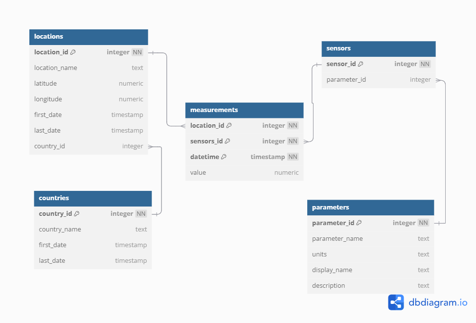
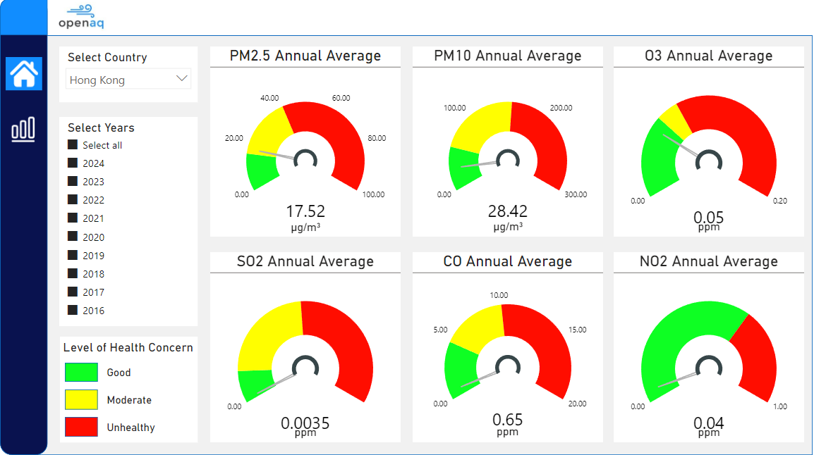
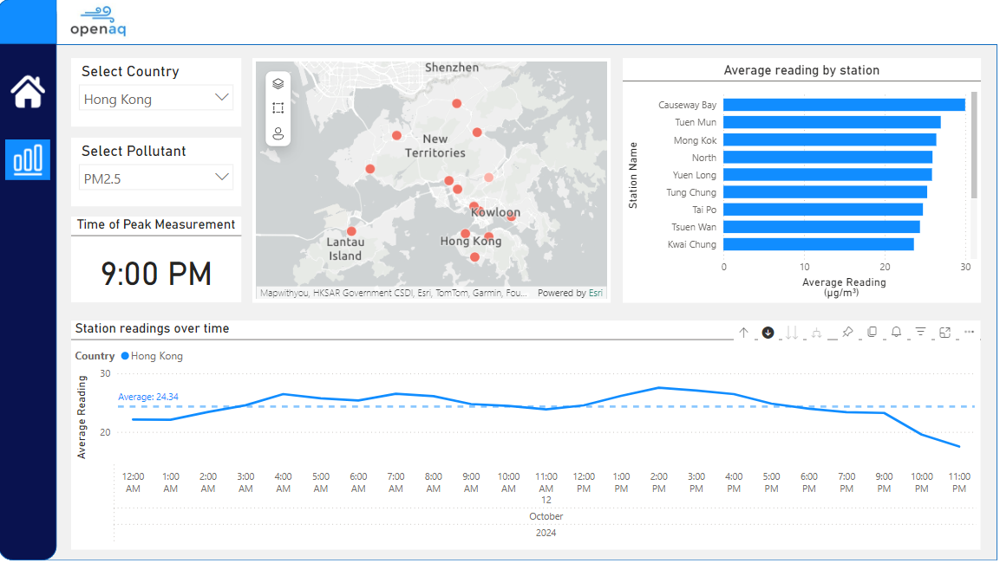
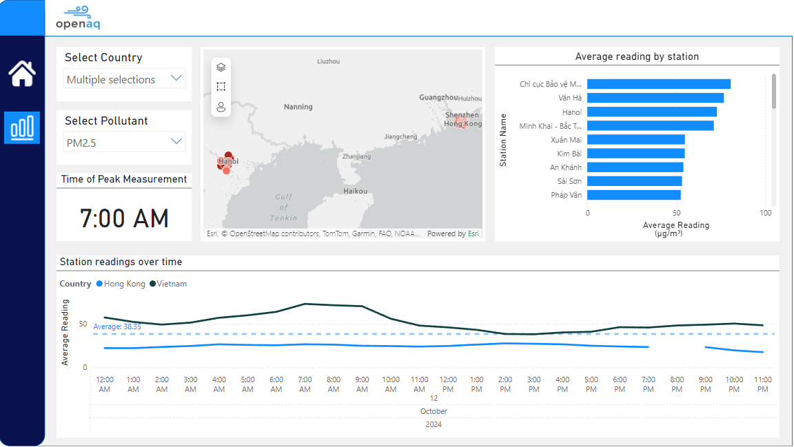

# openAQ-download

This repository contains scripts that automatically download all available historical data for a given set of countries from [openAQ](https://docs.openaq.org/aws/about). The collected data is then stored in a Postgres database.

The data of openAQ comes from sensors situated in specific locations spread throughout a country. To download the data directly from openAQ, the user would need to supply each of the location IDs which would be time consuming if the user is interested in collecting all of the data for a certain country. 

The scripts will help the user to automatically collect data from all of the sensors located in the countries of interest.    

### How it works

The data downloaded from the openAQ S3 bucket is stored in a narrow format. More details can be found [here](https://docs.openaq.org/aws/about). 

When downloading for multiple countries, the size of data may reach up to millions of rows. To lessen the size, the narrow table is normalized into a snowflake schema.

* The dimension tables are populated using the openAQ API. This is implement through the script [`create_table.py`](./scripts/create_table.py).

* The fact table is populated by downloading the data directly from the AWS S3 bucket. This is implemented through the script [`dl_from_aws.py`](./scripts/dl_from_aws.py).

### Usage

1. Install Docker 

2. Create an openAQ account to get an [API key](https://docs.openaq.org/using-the-api/api-key)

2. Rename `dev.env` to `.env` and fill in the necessary variables.
    * Run `mv dev.env .env`
    * **The countries of interest will be specified in this file**

3. Run `docker compose build` then `docker compose up -d`

   
### Data Visualization

Dashboard creation for learning purposes. 

